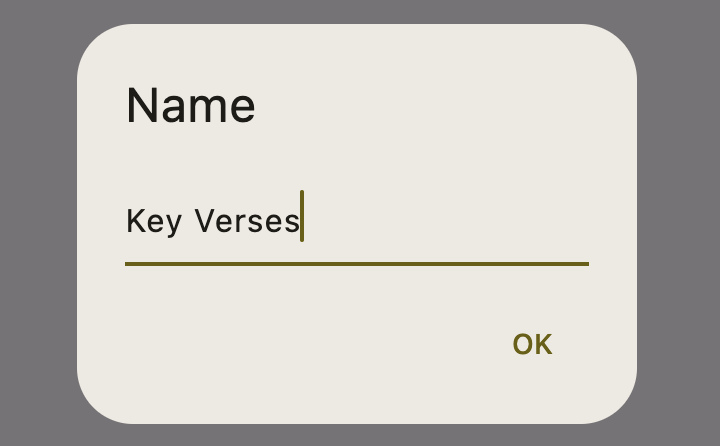
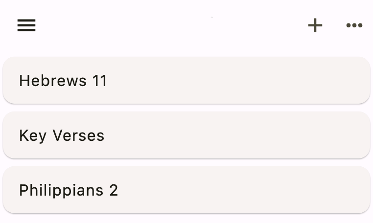
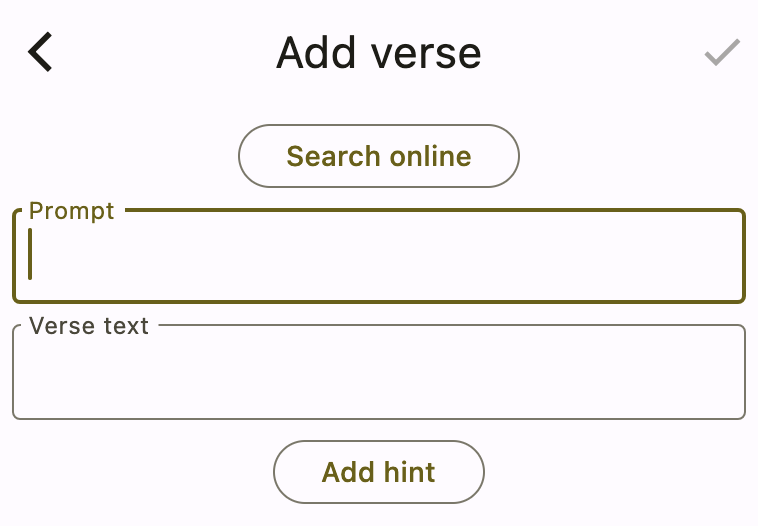
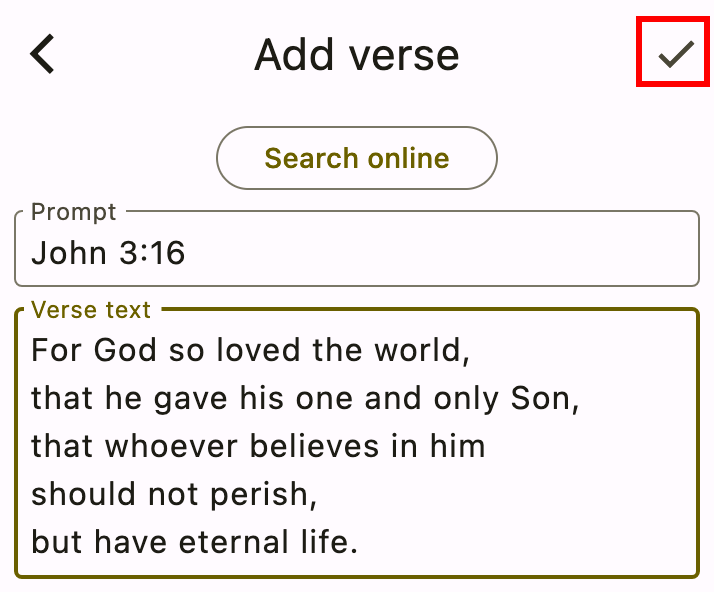

# Getting Started

You'll want to put the verses you memorize into collections. There are two different types of collections you can make:

- **Key verse collection**: These are an assortment of verses from various parts of the Bible. For example: John 3:16, Genesis 1:1, Romans 6:36.
- **Passage collection**: These are consecutive verses that come from the same section in the Bible. For example, a whole chapter like Hebrews 11 or a passage like Philippians 2:1-10.

The app itself doesn't differentiate these types, but it may help you to organize your own memory work in this way.

## Adding a collection

Add a new collection now by clicking the **+** button in the top right of the home screen:

<div class="bordered-image">


</div>


Name the collection **Key Verses**. 

<div class="bordered-image">


</div>

Press **OK** and you should see something like the following:

<div class="bordered-image">


</div>

Add two more collections with the following names:

- Hebrews 11
- Philippians 2

Now your home screen should look like the following:

<div class="bordered-image">


</div>

You have one key verse collection and two passage collections.

:::tip
The collection names are displayed alphabetically. If you want to display them in Bible order, one trick is to prefix the name with a number. For example:

```
01. Genesis 12
02. Exodus 20
66. Revelation 2-3
```
:::

## Adding a verse

Depending on whether you are memorizing an assortment of key verses or a long passage, there are at least two different strategies for entering verses in a collection.

### In a key verse collection

Start by entering verses in the Key Verse collection you made earlier. Click the **Key Verses** collection item in the list. You'll see the following screen:

<div class="bordered-image">


</div>

Follow the directions and click the **+** button in the top right. That'll show you the **Add Verse** page:

<div class="bordered-image">


</div>

Here's the meaning of these two text input boxes:

- The **prompt** is what the app will show when it's prompting you to quote a verse from memory. For a key verse collection, most people will probably write the verse reference here.
- The **verse text** is what you're trying to quote. The app will hide this text from you until you're ready to check yourself.

Copy the reference below and paste it into the **Prompt** box:

```text
John 3:16
```

Then copy and paste the following into the **Verse text** box:

```text
For God so loved the world, 
that he gave his one and only Son, 
that whoever believes in him 
should not perish, 
but have eternal life.
```

:::note
The translation above is from the [World English Bible](https://worldenglish.bible/) (WEB). It's one of the only modern translations that has been released into the public domain. All verses quoted in this tutorial use the WEB version.
:::

To save the verse, press the **check mark button** in the top right:

<div class="bordered-image">


</div>

You can continue adding as many verses as you like. When you're finished, press the back button twice to return to the home screen.

:::tip
You can use sites like [YouVersion](https://www.bible.com/) or [BibleGateway](https://www.biblegateway.com/) to look up verses so that you can copy and paste them into the app. On the other hand, entering them in by hand is good for your memory, too.
:::

### In a passage collection

If you're memorizing a long passage of scripture, only using the reference as the prompt can get confusing. A better prompt is to use the previous verse to remind you of the next one.

In the home screen, choose the **Hebrews 11** collection that you created earlier.

<div class="bordered-image">


</div>

Then, continue as before to begin adding verses.

Copy and paste the prompt and verse text for the **first verse**:

Prompt:

```text
Hebrews 11:01
```

Verse text:

```text
Hebrews 11:01
Now faith is assurance 
of things hoped for, 
proof of things not seen.
```

Here are a few things to note:

- The prompt for the very first verse of a passage can use a simple reference.
- Verses in a collection are sorted alphabetically by the prompt. You used 11:01 rather than 11:1 to make sure that this verse is sorted before Hebrews 11:10.

Save that verse, and then add the prompt and text for the **second verse**:

Prompt:

```text
Hebrews 11:01
Now faith is assurance 
of things hoped for, 
proof of things not seen.
```

Verse text:

```text
Hebrews 11:02
For by this, 
the elders obtained approval. 
```

Save that and add the **third verse**:

Prompt:

```text
Hebrews 11:02
For by this, 
the elders obtained approval.
```

Verse text:

```text
Hebrews 11:03
By faith we understand 
that the universe has been framed 
by the word of God, 
so that what is seen 
has not been made 
out of things which are visible.
```

And on you'll continue for each verse. You see the pattern now. Besides the first one, the prompt is always the previous verse. That's what the app will show to remind you of the next verse that you're trying to quote.

:::tip
Don't enter too many new verses at once. Instead, only add a new verse at the point you're ready for it. One new verse a week is a good long-term strategy.
:::

In the next section, you'll learn how to practice the verses you've entered.