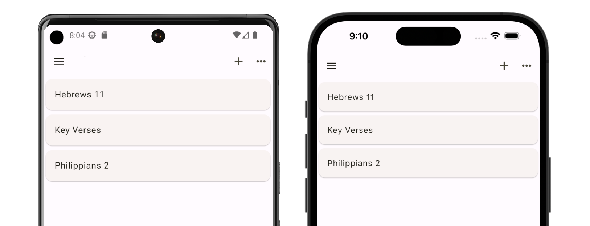

# Memorize Scripture

Memorize Scripture is an [**Android**](https://play.google.com/store/apps/details?id=dev.ethnos.memorize_scripture) and [**iOS**](https://apps.apple.com/us/app/memorize-scripture-ethnosdev/id6449814205) app to help you learn Bible verses by heart. 

This tutorial will introduce you to how the app works. To get started, click the **Next** button below.
