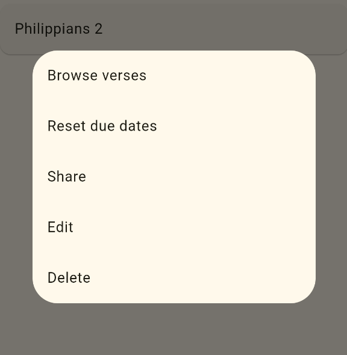
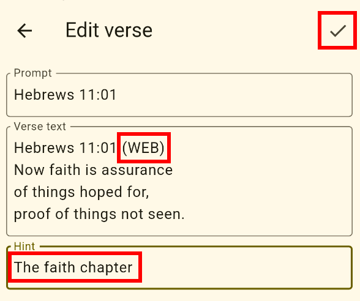
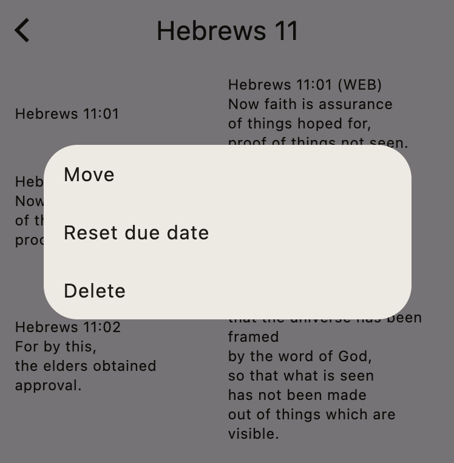

# Making Changes

In this section, you'll learn how to manage your verse collections.

## Renaming collections

To rename a collection, go to the home screen and long-press the collection name. Try that now. Long-press your **Philippians 2** collection. This will show the following menu:

Choose **Rename** and change the name to **Philippians 3**.

##  Deleting collections

To delete a collection, long-press the collection name and choose **Delete** from the menu.

Try that now. Delete your **Philippians 3** collection.

## Editing verses

From the home screen, long-press your **Hebrews 11** collection. Then choose **View** from the menu. This will bring you to the verse browser. You should see all three verses that you added earlier:

You can edit a verse by tapping it.

Tap the first verse and make a small change. For example, add **(WEB)** after the reference in the verse text. Then tap the **Check** button to save your changes.

## Resetting the due date

Back in the Hebrews 11 view screen, long-press the third verse. You'll see another menu:

Press **Reset due date**. This will make the third verse new again, as if you had just entered it and never practiced it before. This is useful if you accidentally mark a verse as Good before you're ready.

## Deleting verses

If you want to delete a verse, choose **Delete** from the same menu as in the previous example.