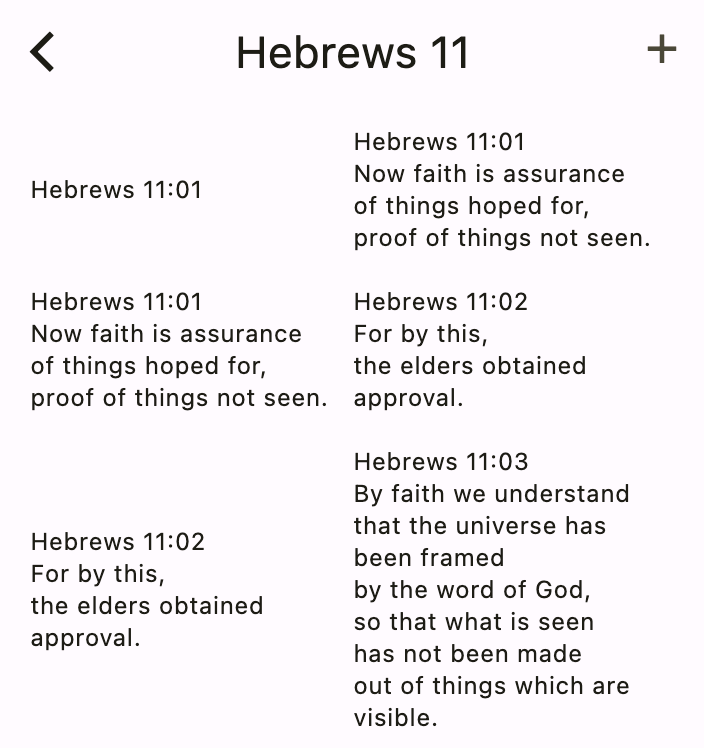

# Making Changes

In this section, you'll learn how to manage your verse collections.

## Editing collections

To rename a collection or change its review style, go to the home screen and long-press the collection name. Try that now. Long-press your **Philippians 2** collection. This will show the following menu:

Choose **Edit** and change the name to **Philippians 3**. Also, change the review style to **Fixed number of verses**. You can leave the default of 5 verses per day.

Press **OK** to save the changes.

##  Deleting collections

To delete a collection, long-press the collection name and choose **Delete** from the menu.

Try that now. Delete your **Philippians 3** collection.

## Resetting due dates

If you haven't been working on a particular collection for a while, sometimes its convenient to reset all of the verse due dates. You can do that by choosing **Reset due dates** from the menu. This essentially makes them all like newly added verses.

Try that now. Reset your progress for the **Hebrews 11** collection.

## Editing verses

From the home screen, long-press your **Hebrews 11** collection. Then choose **Browse verses** from the menu. This will bring you to the verse browser. You should see all three verses that you added earlier:

You can edit a verse by tapping it.

Tap the first verse and change something. For example:

- Add **(WEB)** after the reference in the verse text. 
- Also add a hint: **The faith chapter**. 

Then tap the **Check** button to save your changes.

## Other verse operations

Back in the Hebrews 11 view screen, long-press the third verse. You'll see another menu:

These are the meanings of the menu items:

- **Copy verse text**: This will copy the verse text to the clipboard, which is useful when adding a new verse where the prompt is the is the previous verse text.
- **Move**: Choose this to move the verse to a different collection.
- **Reset due date**: This resets the progress for this verse only.
- **Delete**: This deletes the selected verse.

You don't need to do any of these things right now. Tap outside of the menu to dismiss it.

## Backing up and restoring collections

Return to the home screen with your collections list. Choose the three-dot menu in the top right:

This will give you three options:

Here are their meanings:

- **Sync**: This will save your collections on an online server so that you access them from another device or retrieve them if you lose your phone. To accomplish this, though, you'll have to create a new user account. 
- **Backup**: Choose this option if you don't want to sign up for a new account. This will extract all of your collections and verses from the app's local database and put them in a text file with a _.json_ ending. You'll be given an opportunity to choose a location to share this file to. For example, you could send yourself an email or store it as a file. It's a good idea to back up your collections every now and then so that if you loose your phone, you won't loose all of your hard work.
- **Import**: This is for restoring a previous backup from a file. If there are duplicates verses between the backup and your current collections, the app will go with the verses that were modified most recently.

You may also recall seeing the **Share** option in the collection menu:

This option is similar to Backup but only for a single collection. You can use this to share a collection with a friend. Unlike Backup, Share does not retain your practice information. Your friend can add this collection to their app by selecting the shared file from the Import menu.