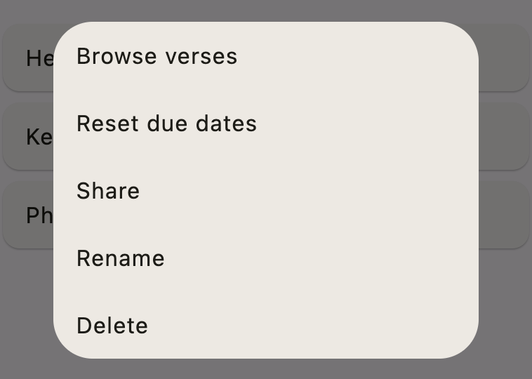
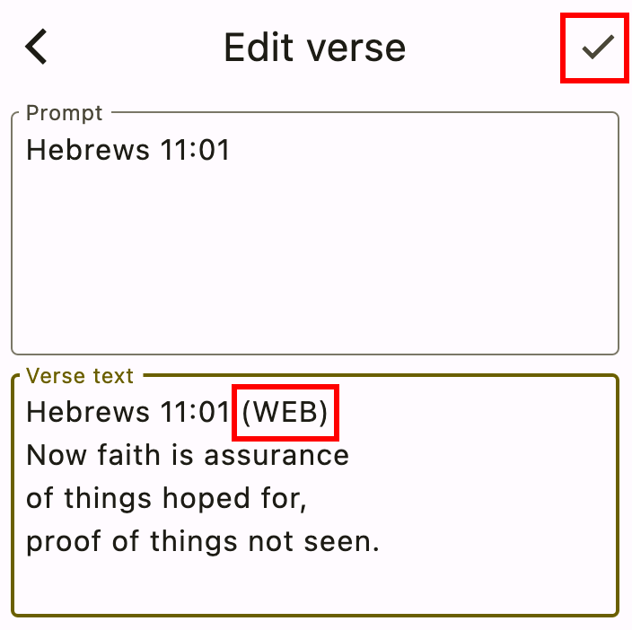
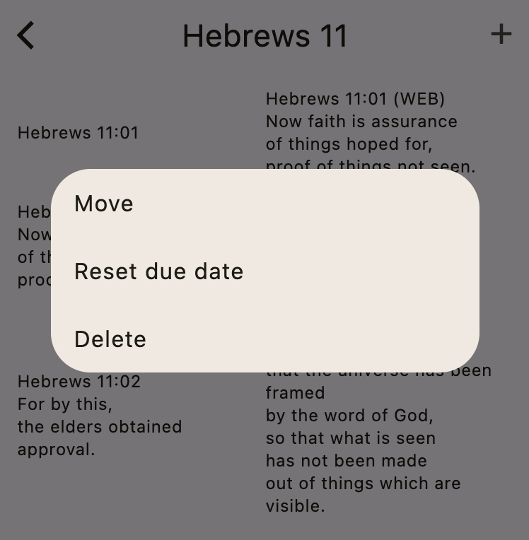
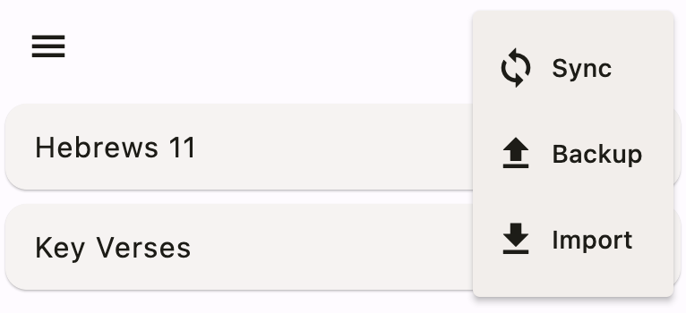

# Making Changes

In this section, you'll learn how to manage your verse collections.

## Renaming collections

To rename a collection, go to the home screen and long-press the collection name. Try that now. Long-press your **Philippians 2** collection. This will show the following menu:

Choose **Rename** and change the name to **Philippians 3**.

##  Deleting collections

To delete a collection, long-press the collection name and choose **Delete** from the menu.

Try that now. Delete your **Philippians 3** collection.

## Resetting due dates

If you previously worked on a collection of verses but now would like to reset any progress you made, choose **Reset due dates** from the menu. This essentially makes them all like newly added verses.

Try that now. Reset your progress for the **Hebrews 11** collection.

## Editing verses

From the home screen, long-press your **Hebrews 11** collection. Then choose **Browse verses** from the menu. This will bring you to the verse browser. You should see all three verses that you added earlier:

You can edit a verse by tapping it.

Tap the first verse and make a small change. For example, add **(WEB)** after the reference in the verse text. Then tap the **Check** button to save your changes.

## Other verse operations

Back in the Hebrews 11 view screen, long-press the third verse. You'll see another menu:

These are the meanings of the menu items:

- **Move**: Choose this to move the verse to a different collection.
- **Reset due date**: This resets the progress for this verse only.
- **Delete**: This deletes the selected verse.

## Backing up and restoring collections

Return to the home screen with your collections list. Choose the three-dot menu in the top right:

This will give you two options:

This is the meaning:

- **Backup**: This will extract all of your collections and verses from the app's database and put them in a text file. You'll be given an opportunity to choose a location to share this file to. For example, you could send yourself an email. It's a good idea to back up your collections every now and then so that if you loose your phone, you won't loose all of your hard work.
- **Import**: Choose this option to restore a previous backup. If there are duplicates verses between the backup and your current collections, the app will go with the verses that were modified most recently.

You may also recall seeing the **Share** option in the collection menu:

This option is similar to Backup but only for a single collection. You can use this to share a collection with a friend. Unlike Backup, Share does not retain your practice information. Your friend can add this collection to their app by selecting the shared file from the Import menu.