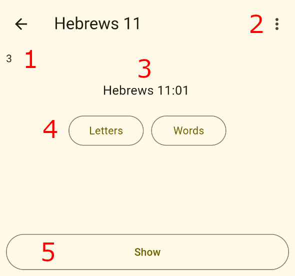
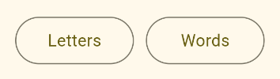
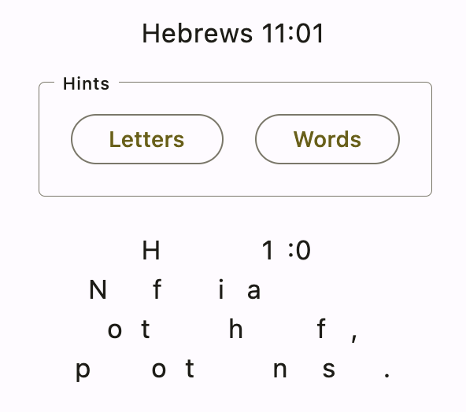
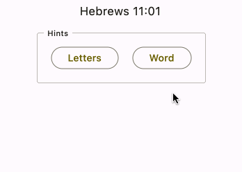
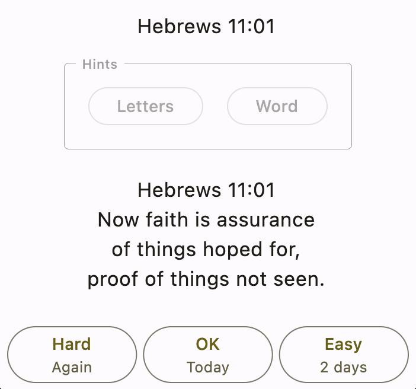
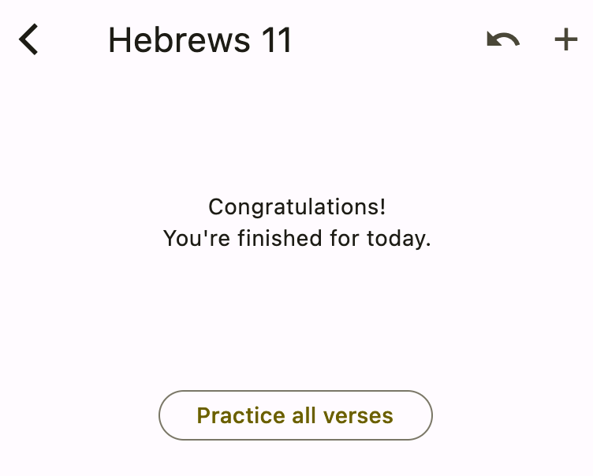

# Practicing

Now that you know how to create collections and add verses, it's time to learn about practicing verses.

:::important
This app assumes that you'll practice every day. Begin to develop this important habit today!
:::

Starting from the home screen, choose the **Hebrews 11** collection that you made earlier. You should see the verse practice screen come up.

## Parts of the screen

Have a look at the various parts of the verse practice screen:

The numbers correspond to the following parts:

1. **Remaining verses today**: This is the number of verses that are due to practice today. You entered three new verses earlier, so that's where this number comes from. Today they're all new, but in the future, you'll also have old verses to review.
2. **Edit verse**: Press this button to edit the prompt and verse text.
3. **Add new verse**: This is the same as what you did previously.
4. **Prompt**: This is your queue to help you remember what you need to quote.
5. **Hints**: These give you a little help if you need it. More on them shortly.
6. **Show verse text**: Press this button to check if you quoted the verse right.

:::note
If you entered new verses and they aren't all showing up, check the **Max new verses per day** value in settings. You may want to increase it to something like 10.
:::

## Showing hints

There are two different types of hints: letters and words.

### Letters

Start by pressing the **Letters** hint button. This shows you the first letter of every word in the verse text:

You can see how they correspond wih the verse text you entered earlier for Hebrews 11:01:

> **H**ebrews **1**1:**0**1  
> **N**ow **f**aith **i**s **a**ssurance  
> **o**f **t**hings **h**oped **f**or,  
> **p**roof **o**f **t**hings **n**ot **s**een.  

Knowing the first letters might be just enough information to help you with a tricky verse.

### Word

Now press the **Word** hint button. You'll see that it shows you the first word of your verse text, which in this case is "Hebrews". Continue to press **Word** and you'll incrementally reveal more words in the verse:

This allows you to give yourself just the amount of help that you need.

If you press the Word hint button enough, it'll reveal the entire verse text, which will trigger the response buttons being shown at the bottom. That's fine, but for the sake of this tutorial, let's cancel the hints so that you can see how to show the verse text the normal way. To do that, go back out to the home screen by pressing the **<** back button. Then choose the **Hebrews 11** collection again.

## Showing the verse text

After being shown the prompt, you should try to quote the verse to yourself. When you're finished, it's time to check yourself. To do that, press the **Show** button at the bottom of the practice screen.

This will show you the entire verse text at once:

In the next section you'll learn what the response buttons mean.

## Responding

Memorize Scripture uses a spaced repetition strategy for reviewing verses. That means you'll practice the difficult verses every day while the easy verses you'll practice less frequently.

You determine the verse difficulty yourself by using the response buttons. There are three of these buttons: Hard, OK, and Easy.

These are the meanings:

- **Hard**: Press this button if you couldn't remember the verse or if you made a mistake while quoting it. For old verses, this will reset the due date so that you'll begin reviewing the verse daily again. For new verses, it schedules the verse so that you'll practice it again in a few minutes.
- **OK**: Press this button if you quoted the verse correctly. For new verses, the button says "Today" because you still need to review it more more time today. For old verses, the button will say "1 day" or "2 days", etc. Every time you review and press OK, the number of days for that verse will increase by one.
- **Easy**: Press this button if you could quote the verse in your sleep. For review verses, the number of days will be double whatever the OK button says.

Go through all three verses pressing OK for each one. The next time you come to Hebrews 11:01, the OK response button will look a little different:

Now the OK button says "1 day". If you press OK again, you're finished practicing it, and you won't see it again until tomorrow.

Press **OK** again for each of the three verses. You'll see the remaining verse number in the top left decrease until there are no more verses left.

That's how practicing works. In the next section, you'll learn how to do things like rename collections and delete verses.