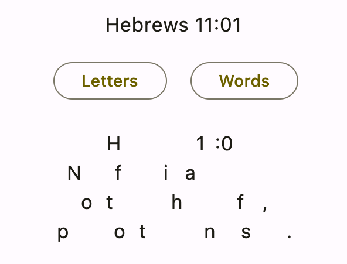
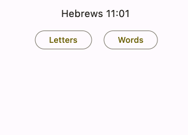

# Practicing

Now that you know how to create collections and add verses, it's time to learn about practicing verses.

:::important
This app assumes that you'll practice every day. Begin to develop this important habit today! If you need a reminder, go to the app settings and turn on daily notifications.
:::

Starting from the home screen, choose the **Hebrews 11** collection that you made earlier. You should see the verse practice screen come up.

## Parts of the screen

Have a look at the various parts of the verse practice screen:

The numbers correspond to the following parts:

1. **Remaining verses today**: This is the number of verses that are due to practice today. You entered three new verses earlier, so that's where this number comes from. Today they're all new, but in the future, you'll also have old verses to review.
2. **Menu**: Press this button to edit the current verse, add a new verse, or browse all the verses in the collection.
3. **Prompt**: This is your queue to help you remember what you need to quote.
4. **Hints**: These give you a little help if you need it. More on them shortly.
5. **Show verse text**: Press this button to check if you quoted the verse right.

:::note
If you entered new verses and they aren't all showing up, check the **Max new verses per day** value in settings. The default is 10.
:::

## Showing hints

There are two different types of hints: letters and words.

:::info
If you provide a custom hint when adding a verse, a third button named **Hint** will also appear here. Use this for any sort of mnemonic device that will help you remember the verse.
:::

### Letters

Start by pressing the **Letters** hint button. This shows you the first letter of every word in the verse text:

You can see how they correspond wih the verse text you entered earlier for Hebrews 11:01:

> **H**ebrews **1**1:**0**1  
> **N**ow **f**aith **i**s **a**ssurance  
> **o**f **t**hings **h**oped **f**or,  
> **p**roof **o**f **t**hings **n**ot **s**een.  

Knowing the first letters might be just enough information to help you with a tricky verse.

:::tip
Tap a hidden word to reveal the whole thing.
:::

### Words

Now press the **Word** hint button. You'll see that it shows you the first word of your verse text, which in this case is "Hebrews". Continue to press **Word** and you'll incrementally reveal more words in the verse. You can also tap the verse area itself to reveal the next word:

This allows you to give yourself just the amount of help that you need.

If you press the Word hint button enough, it'll reveal the entire verse text, which will disable the hint buttons and trigger the response buttons being shown at the bottom. That's fine, but for the sake of this tutorial, let's cancel the hints so that you can see how to show the verse text the normal way. To do that, go back out to the home screen by pressing the **<** back button. Then choose the **Hebrews 11** collection again.

## Showing the verse text

After being shown the prompt, you should try to quote the verse to yourself. When you're finished, it's time to check yourself. To do that, press the **Show** button at the bottom of the practice screen.

This will show you the entire verse text at once:

In the next section you'll learn what the response buttons mean.

## Responding

Memorize Scripture uses a spaced repetition strategy for reviewing verses. That means you'll practice the difficult verses every day while the easy verses you'll practice less frequently.

You determine the verse difficulty yourself by using the response buttons. There are four of these buttons by default: Hard, OK, Good, and Easy.

These are the meanings:

- **Hard**: Press this button if you can't remember the verse or if you make a mistake while quoting it. The app will give it to you again in a little while.
- **OK**: Press this button if you got the verse right, but it was a bit of a struggle. For new verses, you still need to review it one more time today, so the button gives an approximate time in minutes until the next review. Even for old verses, though, pressing OK will never schedule the next review more than 1 day away.
- **Good**: Press this button if you quoted the verse correctly. Every time you review and press Good, the number of days before the next review will increase by one.
- **Easy**: Press this button if you could say the verse in your sleep. This button will schedule the next review for double the number of days of whatever Good is.

:::tip
**Simple button layout**: Are four buttons too much for you to think about? Do you want the app to worry about when to schedule the next review? Try the two-button layout. Go to **Settings** in the app menu and turn on **Two-button response** mode. This will give you only two choices for every verse:

Pressing Hard will give you the verse again today. It will also reset any previous progress so you'll get the verse again tomorrow, too. Pressing Good will make use of the app's spaced repetition algorithm to gradually increase the length of time between reviews.
:::

Go through all three verses, pressing **Good** for each one. You'll see the remaining verses number in the top left decrease until there are no more verses left.

A congratulatory message will greet you when you're finished:

There are also two more buttons here:

- **Undo**: This button is the curved arrow in the top right (to the left of the Add button). Choose Undo if you accidentally pressed the wrong response button and the verse disappeared.
- **Practice all verses**: This is for casual practice. It'll give you all of the verses in the collection regardless of the due dates. The response buttons won't affect the due dates, either.

That's how practicing works. In the next section, you'll learn how to do things like rename collections and delete verses.