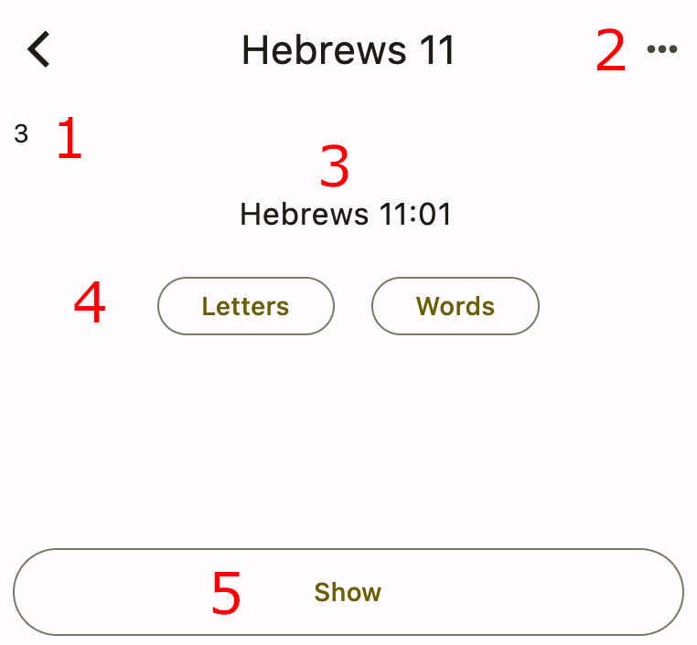
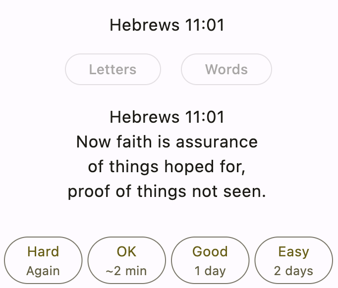

# Practicing

Now that you know how to create collections and add verses, it's time to learn about practicing verses.

:::important
This app assumes that you'll practice every day. Begin to develop this important habit today! If you need a reminder, go to the app settings and turn on daily notifications.
:::

Starting from the home screen, choose the **Hebrews 11** collection that you made earlier. You should see the verse practice screen come up.

## Parts of the screen

Have a look at the various parts of the verse practice screen:

The numbers correspond to the following parts:

1. **Remaining verses today**: This is the number of verses that are due to practice today. You entered three new verses earlier, so that's where this number comes from. Today they're all new, but in the future, you'll also have old verses to review.
2. **Menu**: Press this button to edit the current verse, move it to a different collection, add a new verse, browse all the verses in the collection, or shuffle the practice order of today's verses.
3. **Prompt**: This is your queue to help you remember what you need to quote.
4. **Hints**: These buttons give you a little help if you need it. More on them shortly.
5. **Show verse text**: Press this button to check if you quoted the verse right.

## Showing hints

There are two different types of hints: letters and words.

:::info
If you provide a custom hint when adding a verse, a third button named **Hint** will also appear here. Use this for any sort of mnemonic device that will help you remember the verse.
:::

### Letters

Start by pressing the **Letters** hint button. This shows you the first letter of every word in the verse text:

You can see how they correspond wih the verse text you entered earlier for Hebrews 11:01:

> **H**ebrews **1**1:**0**1  
> **N**ow **f**aith **i**s **a**ssurance  
> **o**f **t**hings **h**oped **f**or,  
> **p**roof **o**f **t**hings **n**ot **s**een.  

Knowing the first letters might be just enough information to help you with a tricky verse.

:::tip
Tap a hidden word to reveal the whole thing.
:::

### Words

Now press the **Word** hint button. You'll see that it shows you the first word of your verse text, which in this case is "Hebrews". Continue to press **Word** and you'll incrementally reveal more words in the verse:

:::tip
After pressing the Word button at least once, you can also tap the verse area itself to reveal the next word.
:::

This allows you to give yourself just the amount of help that you need.

If you press the Word hint button enough, it'll reveal the entire verse text, which will disable the hint buttons and trigger the response buttons being shown at the bottom. That's fine, but for the sake of this tutorial, let's cancel the hints so that you can see how to show the verse text the normal way. To do that, go back out to the home screen by pressing the < back button. Then choose the **Hebrews 11** collection again.

## Showing the verse text

After being shown the prompt, you should try to quote the verse to yourself. When you're finished, it's time to check yourself. To do that, press the **Show** button at the bottom of the practice screen.

This will show you the entire verse text at once:

In the next section you'll learn what the response buttons mean.

## Responding

If you recall from when you created the collection, there were three different review style options:

- Spaced repetition
- Choose frequency
- Fixed number of verses

The default was spaced repetition, but you can change that in the Home screen by long-pressing the collection name and choosing Edit from the menu.

The response buttons look a little different for each review style, so the following sections will explain them for each one.

### Spaced repetition

With the spaced repetition review style, there are only two response buttons:

These are the meanings:

- **Hard**: Press this button if you can't remember the verse or if you make a mistake while quoting it. The app will put this verse at the end of today's list. And you'll get it again tomorrow, too.
- **Good**: Press this button if you quoted the verse correctly. Every time you review and press Good, the number of days before the next review will increase by one.

As long as you are practicing daily, this review style will allow you to maintain hundreds of verses without having too many on any particular day. You'll review old verses at just the frequency you need to before forgetting them.

### Choose frequency

The "Choose frequency" review style is for those who want to have more decision-making power over how often they practice a verse. With this style, there are four response buttons:

These are the meanings:

- **Hard**: Press this button if you want to practice the verse again today. The app will put it at the end of today's list.
- **OK**: Press this button if you want to review the verse again tomorrow.
- **Good**: Press this button if you want to review the verse in a week. If 7 days is too long, you can long-press the Good button to change it to a different number of days.
- **Easy**: Press this button if you want to review the verse in a month. If 30 days is too long, you can long-press the Easy button to change it to a different number of days.

This review style may be useful if you have some new verses that you want to review every day for a period of time. It's also useful if you want to ensure that the interval between reviews never exceeds a certain number of days. Beware, though, that the reviews may tend to pile up on you, especially if you aren't practicing daily.

### Fixed number of verses

The "Fixed number of verses" review style is for those who always want to have the same number of verses to review each day. With this style, there are only two response buttons:

These are the meanings:

- **Hard**: Press this button if you want to review the verse again today.
- **Good**: Press this button if you've got it.

This review style is good for those who don't want to worry about due dates. Even if you only review once a week, you won't be overloaded by a mountain of verses.

## Practicing the day's verses

Unless you chose something different, your review style is Spaced Repetition (a good choice for most people). Go through all three verses, pressing **Good** for each one. You'll see the remaining verses number in the top left decrease until there are no more verses left.

A congratulatory message will greet you when you're finished:

The "Practice all verses" button is for casual practice. It'll give you all of the verses in the collection regardless of the due dates. The response buttons won't affect the due dates, either.

That's how practicing works. In the next section, you'll learn how to do things like rename collections and delete verses.