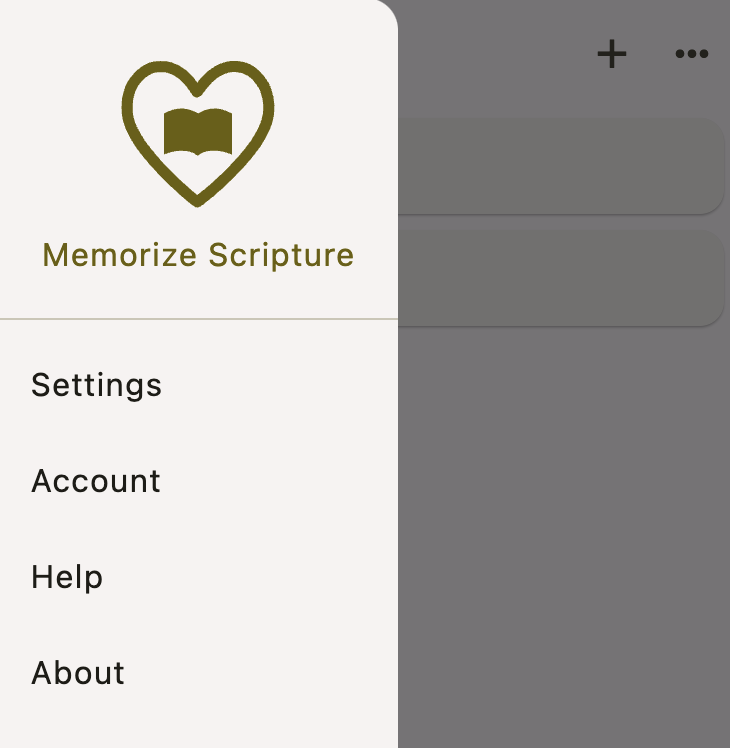

# Other Settings

You can access other settings from the menu in the top left of the home screen:

Press the **menu icon** and then choose **Settings** from the list.

This will give you the following options:

## Dark mode

Choose dark mode to make it easier on your eyes if you practice your verses early in the morning before it gets light.

## Max new verses per day

This is the maximum number of new verses the app will show you every day. The default is 10. Set it to a lower number if you don't want to have so many new verses in one day.

This setting is useful when you reset the due date for all of the verses in a collection but you don't want to practice them all at once.

:::tip
Rather than entering a lot of new verses at once and setting the max new verses to a low number like 1, it's generally better to wait to enter a new verse until you're ready to start learning it.
:::

## Two-button response

The default is to show two response buttons on the practice screen:

If you turn this setting off, you'll have four buttons:

## Conclusion

Congratulations! You've finished the tutorial!

If there were any parts you still found confusing, please leave a comment in the feedback section.