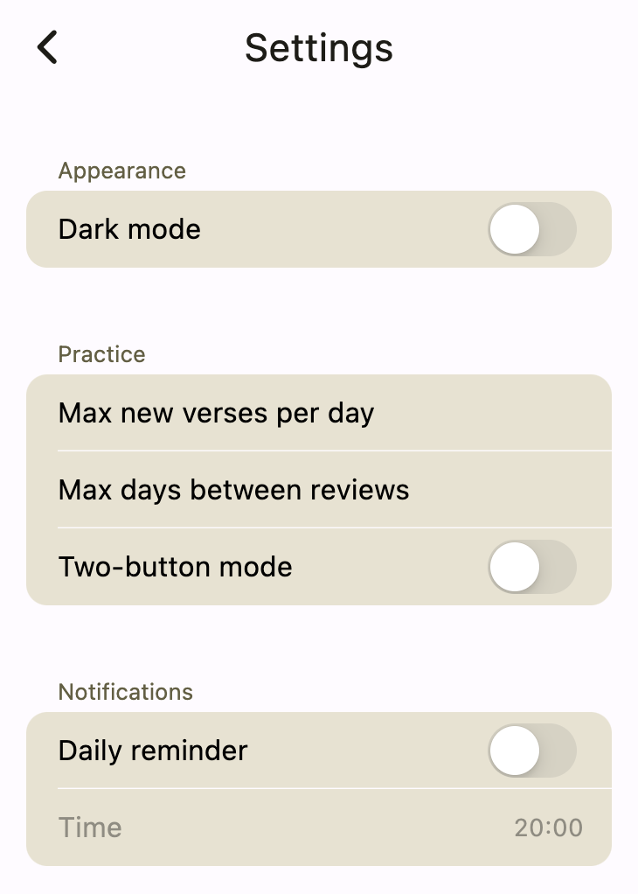

# Other Settings

You can access other settings from the menu in the top left of the home screen:

Press the **menu icon**. You'll see a list of options:

Here are their meaning: 

- **Settings**: Change the app's settings.
- **Account**: Sign in to your account so that you can sync your collections across devices.
- **Help**: A link to this tutorial.
- **About**: Check the app version and get the developer's email address to give feedback.

Choose **Settings** now.

This will give you the following options:

Here is an explanation of what each setting does:

- **Dark mode**: Choose this to make it easier on your eyes if you practice your verses early in the morning before it gets light.
- **Max new verses per day**: This is the maximum number of new verses the app will show you every day. Set it to a number like 5 or 10 if you don't want to get too many new verses in one day. This setting is useful when you reset the due date for all of the verses in a collection, but you don't want to practice them all at once.
- **Daily reminder**: Turn this on to get daily notifications reminding you to review your verses. Once on, chose the **Time** option to set the notification time.
- **Sort in biblical order**: This option will cause the collections and verses to be sorted in the order they appear in the Bible. The caveat is that the books must be spelled correctly in English. When off, the sort order is alphabetical.

## Conclusion

Congratulations! You've finished the tutorial!

If there were any parts you still found confusing, please leave a comment in the feedback section.